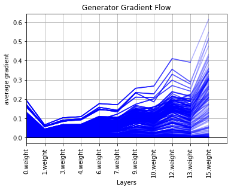
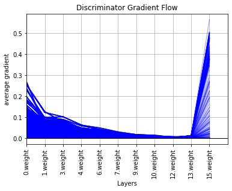
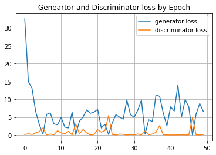

# Pokemon_generator_GAN
## Project Overview
* Implemented a Deep Convolutional Generative Adversarial Network (DCGAN) with the objective of generating new Pokemon concept characters from an existing dataset 
* Used PyTorch along with supporting packages / methods in order to implement discriminator and generator neural networks inspired by existing research and implementation from similar applications
* Performed analysis of discriminator and generator neural networks in order to tune hyperparameters for optimal performance

## Code and Resources Used
**Python Version:** 3.7.4  
**Packages:** IPython, jupyter, matplotlib, os, random, torch, torchvision, tqdm  
**Inspiration:** https://jovian.ai/aakashns/06b-anime-dcgan  
**DC-GAN Research:** [Alec Radford, Luke Metz, Soumith Chintala] https://arxiv.org/abs/1511.06434  
**Datset:** [Vishal Subbiah] https://www.kaggle.com/vishalsubbiah/pokemon-images-and-types   

## Results
  |  
:-------------------------:|:-------------------------:
*Samples from original data* |  *Samples from generated data*

## Analysis
### Gradient Flow
The generator and discriminator networks were expanded with an extra layer (consisting of convolution, batch normalization, and a non-linear activation function), when compared to the reference implementation that was used to generate anime character faces [see “Code and Resources Used” section]. This was partly done to reflect the increased complexity of the task since Pokemon character vary in shape and size to a greater degree. Often adding layers to a neural network can result in reduced performance, primarily due to gradient flow being restricted (vanishing gradient) or over-amplified (exploding gradient) throughout the network. If this occurs, changes made to the model during the training process can have either too little or too great an effect on the model on a given iteration to yield optimal results. The charts below show the gradient flow in both networks.

  |  
:-------------------------:|:-------------------------:
                         
### Generator and Discriminator Loss
Binary Cross-Entropy was used to determine the loss of the generator and discriminator networks. Interpreting the results of the following loss plot compared to traditional ML models can be challenging due to the adversarial relationship between the two networks in GANs. However certain characteristics are desired when observing the loss as a function of training epochs in GANs. One of these characteristics is the discriminator loss decay, some empirical evidence suggests that discriminator loss decay that occurs too rapidly may stunt learning. In order to counteract this individuals[1](#footnote1) have experimented with introducing noise to labels. This option may be explored in the future to further optimize this model.

  

<a name="footnote1">1</a>: https://medium.com/@utk.is.here/keep-calm-and-train-a-gan-pitfalls-and-tips-on-training-generative-adversarial-networks-edd529764aa9
