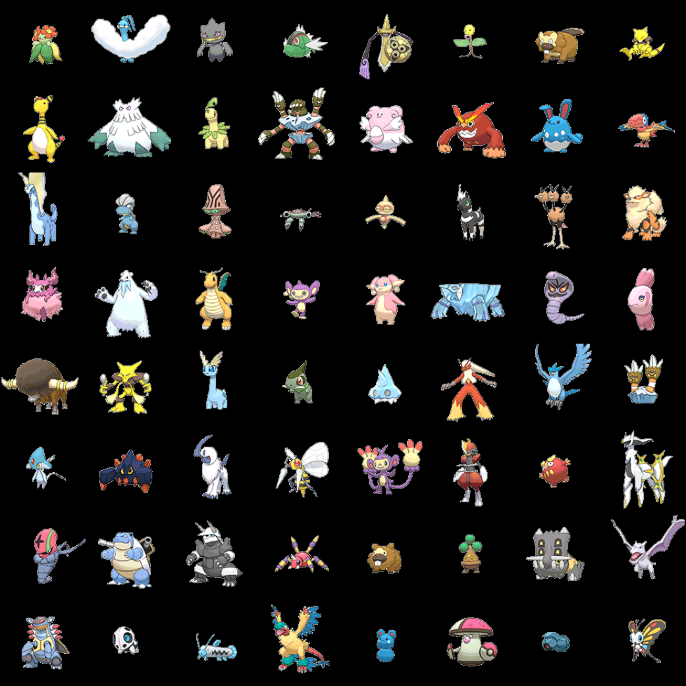
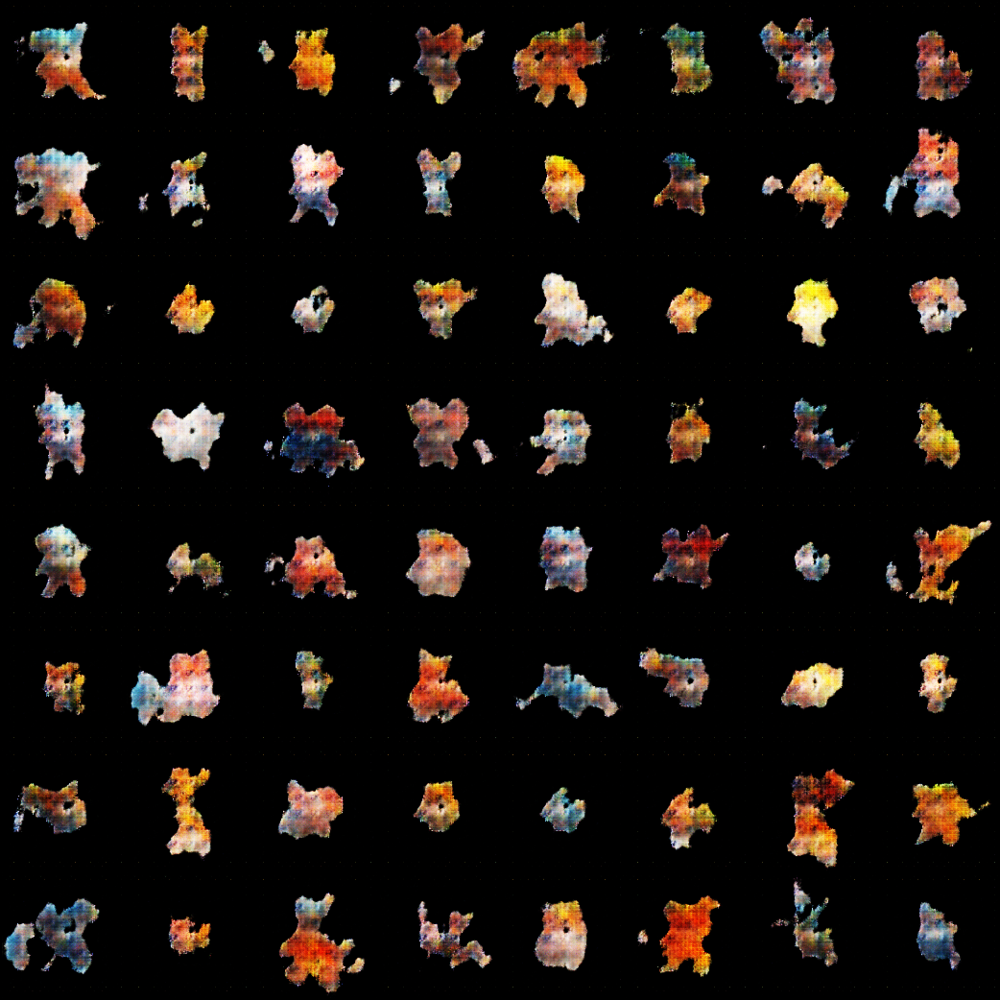

# Pokemon_generator_GAN: Project Overview
* Implemented a Deep Convolutional Generative Adversarial Network (DCGAN) with the objective of generating new Pokemon concept characters from an existing dataset 
* Used PyTorch along with supporting packages / methods in order to implement discriminator and generator neural networks inspired by existing research and implementation from similar applications
* Performed analysis of discriminator and generator neural networks in order to tune hyperparameters for optimal performance

## Code and Resources Used
**Python Version:** 3.7.4  
**Packages:** IPython, jupyter, matplotlib, os, random, torch, torchvision, tqdm  
**Inspiration:** https://jovian.ai/aakashns/06b-anime-dcgan  
**DC-GAN Research:** [Alec Radford, Luke Metz, Soumith Chintala] https://arxiv.org/abs/1511.06434  
**Datset:** [Vishal Subbiah] https://www.kaggle.com/vishalsubbiah/pokemon-images-and-types   

## Results
  |  
:-------------------------:|:-------------------------:
*Samples from original data* |  *Samples from generated data*
